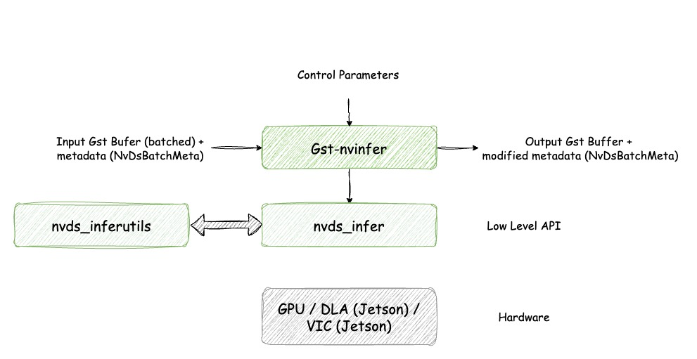

# Deepstream Test 1

The `deepstream-test1` application shows how to use NVIDIA DeepStream SDK elements in a pipeline and extract meaningful insights from a video stream.
This sample creates an instance of the `nvinfer` element, which uses the TensorRT API to perform inference on a model.
It is crucial to configure the `nvinfer` element correctly, as many of its behaviors are parameterized through configuration files.

## Overview


The `deepstream-test1` follows this pipeline:

- **File Source** (`filesrc`): reads a video file
- **H.264 Parser** (`h264parse`): parses the H.264 encoded stream, ensures the input stream is properly formatted before decoding
- **Decoder** (`nvv4l2decoder`): decodes the stream into raw video frames using **NVIDIA hardware acceleration**
- **Stream Muxer** (`nvvstreammux`): batches frames for efficient processing/combines multiple input streams into a single batched buffer for processing
- **Inference** (`nvinfer`): runs a deep learning model on the batched frames
- **On-Screen Display** (`nvdsosd`): draws bounding boxes and labels on detected objects
- **Fake Sink** (`fakesink`): discards the output without rendering. This is especially useful when running on **remote server or Jetson devices without a monitor**



## Preparing the model

This sample uses the [TrafficCamNet](https://catalog.ngc.nvidia.com/orgs/nvidia/teams/tao/models/trafficcamnet) model, which detects 4 classes: `Vehicle`, `Road Sign`, `Two-Wheeler` and `Person`. The configuration file used for this detector is `dstest1_pgie_config.txt`.

### Downloading the model

To use the model, download it from NGC Models using the following commands:
```bash
wget --content-disposition 'https://api.ngc.nvidia.com/v2/models/org/nvidia/team/tao/trafficcamnet/pruned_onnx_v1.0.3/files?redirect=true&path=resnet18_trafficcamnet_pruned.onnx' -O models/Primary_Detector/resnet18_trafficcamnet_pruned.onnx
wget --content-disposition 'https://api.ngc.nvidia.com/v2/models/org/nvidia/team/tao/trafficcamnet/pruned_onnx_v1.0.3/files?redirect=true&path=resnet18_trafficcamnet_pruned_int8.txt' -O models/Primary_Detector/resnet18_trafficcamnet_pruned_int8.txt
```

## Running the application

The application will automatically export the model into an INT8 engine before execution.
```bash
cd apps/deepstream-test1
# Run the test application with an H.264 elementary stream
python3 deepstream_test_1.py /opt/nvidia/deepstream/deepstream/samples/streams/sample_720p.h264
```
