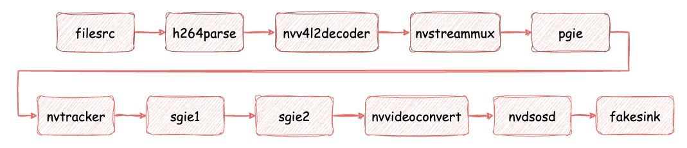

# Deepstream Test 2

This guide explains how to set up and run the `deepstream-test2` application, which demonstrates object detection and tracking using NVIDIA DeepStream. It leverages `nvinfer` as the primary inference engine (pgie) and `nvtracker` for object tracking. Additionally, two secondary inference engines (sgies) classify detected objects.

## Overview



## Preparing the model

This sample application uses the following pre-trained models from NVIDIA’s NGC catalog:

- [TrafficCamNet](https://catalog.ngc.nvidia.com/orgs/nvidia/teams/tao/models/trafficcamnet) model, which detects 4 classes: `Vehicle`, `Road Sign`, `Two-Wheeler` and `Person`. The configuration file used for this detector is `dstest2_pgie_config.txt`.

- [VehicleMakeNet](https://catalog.ngc.nvidia.com/orgs/nvidia/teams/tao/models/vehiclemakenet) model, which classifies car makes in images. The configuration file uses for this classifier is `dstest2_sgie1_config.txt`.

- [VehicleTypeNet](https://catalog.ngc.nvidia.com/orgs/nvidia/teams/tao/models/vehicletypenet) model, which classifies vehicle types. The configuration file uses for this classifier is `dstest2_sgie2_config.txt`.

### Downloading the model

Before running the application, you need to download the required models.
#### Download TrafficCam model & label

Follow the instruction in [deepstream-test1](deepstream-test1.md)

#### Download VehicleMake model & label

To use the model, download it from NGC Models using the following commands:
```bash
wget --content-disposition 'https://api.ngc.nvidia.com/v2/models/org/nvidia/team/tao/vehiclemakenet/pruned_onnx_v1.1.0/files?redirect=true&path=resnet18_pruned.onnx' -O models/Secondary_VehicleMake/resnet18_vehiclemakenet_pruned.onnx

wget --content-disposition 'https://api.ngc.nvidia.com/v2/models/org/nvidia/team/tao/vehiclemakenet/pruned_onnx_v1.1.0/files?redirect=true&path=labels.txt' -O models/Secondary_VehicleMake/labels.txt
```

#### Download VehicleType model & label

To use the model, download it from NGC Models using the following commands:
```bash
wget --content-disposition 'https://api.ngc.nvidia.com/v2/models/org/nvidia/team/tao/vehicletypenet/pruned_onnx_v1.1.0/files?redirect=true&path=resnet18_pruned.onnx' -O models/Secondary_VehicleTypes/resnet18_vehicletypenet_pruned.onnx

wget --content-disposition 'https://api.ngc.nvidia.com/v2/models/org/nvidia/team/tao/vehicletypenet/pruned_onnx_v1.1.0/files?redirect=true&path=labels.txt' -O models/Secondary_VehicleTypes/labels.txt
```

## Running the application

The application will automatically export the model into an INT8 engine before execution.
```bash
cd deepstream-test2
# Run the test application with an H.264 elementary stream
python3 deepstream_test_2.py /opt/nvidia/deepstream/deepstream-6.3/samples/streams/sample_720p.h264
```

This guide ensures a smooth setup and execution of the DeepStream Test 2 application. 🚀
