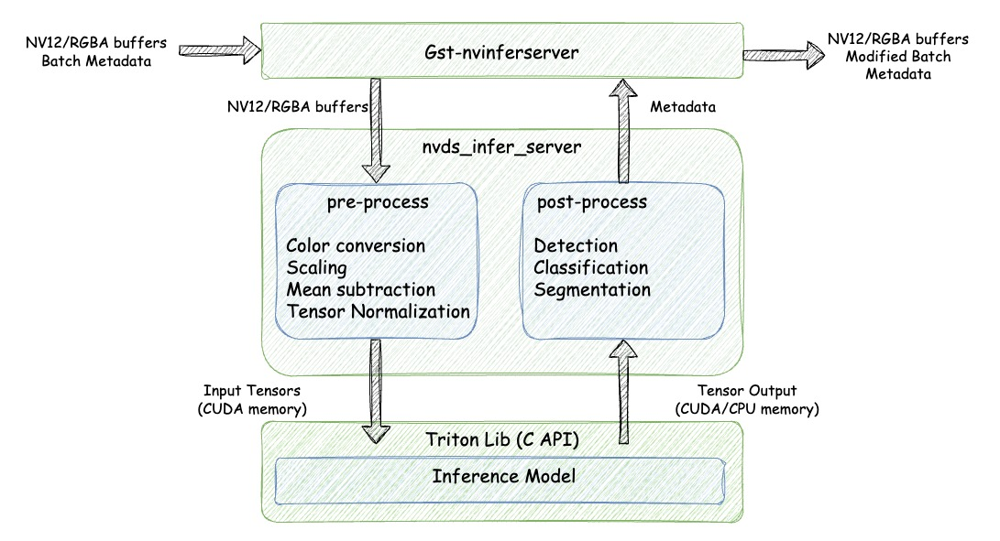

# Deepstream Test 3

This tutorial provides a step-by-step guide to building a DeepStream pipeline that:

* Utilizes `uridecodebin` for handling different types of inputs (RTSP streams, files, different codecs).
* Demonstrates how to enable latency measurement using a probe function.
* Showcases the use of `nvinferserver`, including `nvinferserver` with gRPC-based inference.

## Overview



## Preparing the model

This sample application uses the [PeopleNet](https://catalog.ngc.nvidia.com/orgs/nvidia/teams/tao/models/peoplenet) models from NVIDIA's NGC catalog.

### Downloading the model

To use the model, download it from NGC Models using the following commands:
```bash
wget --content-disposition 'https://api.ngc.nvidia.com/v2/models/org/nvidia/team/tao/peoplenet/deployable_quantized_v2.6/files?redirect=true&path=resnet34_peoplenet_int8.etlt' -O models/tao_pretrained_models/peopleNet/resnet34_peoplenet_int8.etlt

wget --content-disposition 'https://api.ngc.nvidia.com/v2/models/org/nvidia/team/tao/peoplenet/deployable_quantized_v2.6/files?redirect=true&path=resnet34_peoplenet_int8.txt' -O models/tao_pretrained_models/peopleNet/resnet34_peoplenet_int8.txt
```

### Running the application

The application will automatically export the model into an INT8 engine before execution.
```bash
cd apps/deepstream_test_3.py

python3 deepstream_test_3.py -i file:///opt/nvidia/deepstream/deepstream-6.3/samples/streams/sample_1080p_h264.mp4 \
        -c config_infer_primary_peoplenet.txt \
        -g nvinfer \
        --no-display

python3 deepstream_test_3.py -i file:///opt/nvidia/deepstream/deepstream-6.3/samples/streams/sample_1080p_h264.mp4 \
        -c config_triton_infer_primary_peoplenet.txt \
        -g nvinferserver \
        --no-display

python3 deepstream_test_3.py -i file:///opt/nvidia/deepstream/deepstream-6.3/samples/streams/sample_1080p_h264.mp4 \
        -c config_triton_infer_primary_peoplenet.txt \
        -g nvinferserver-grpc \
        --no-display
```
